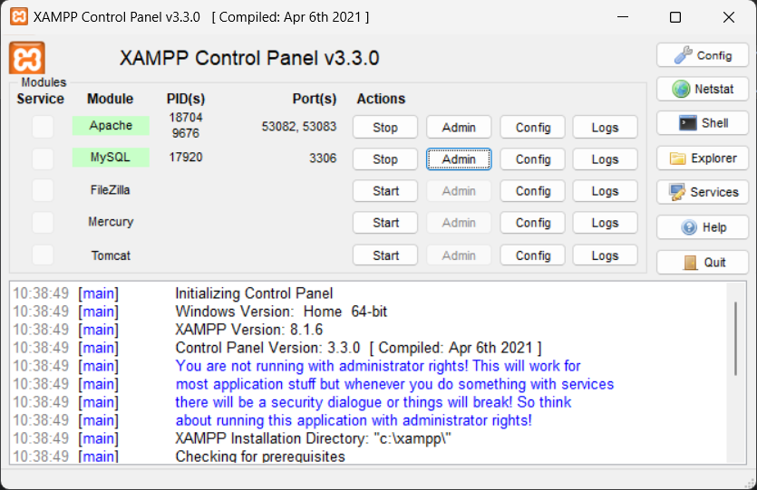
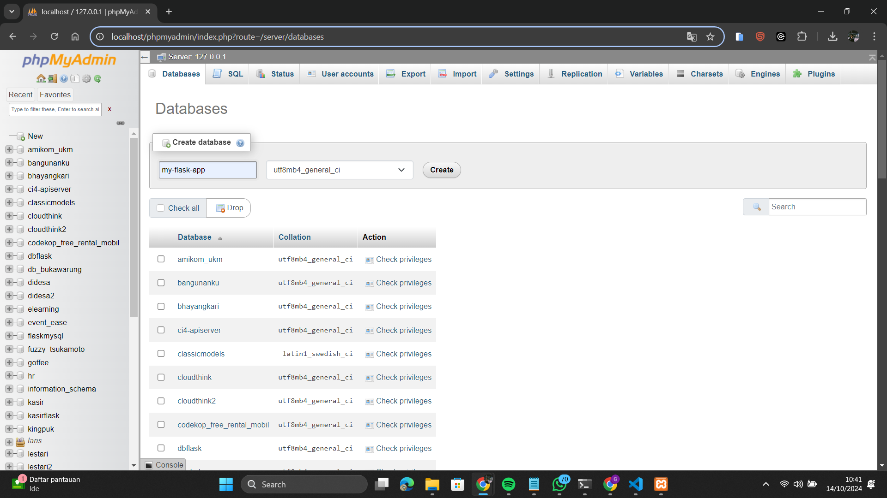
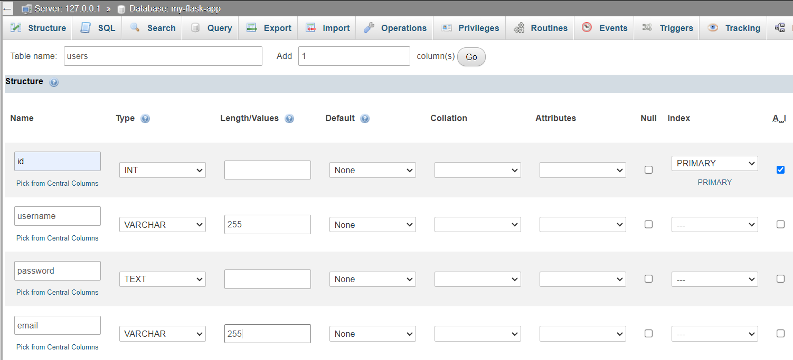
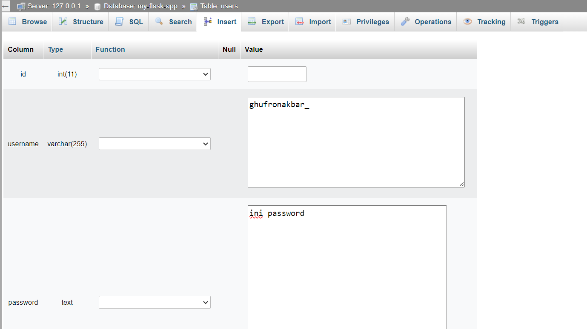
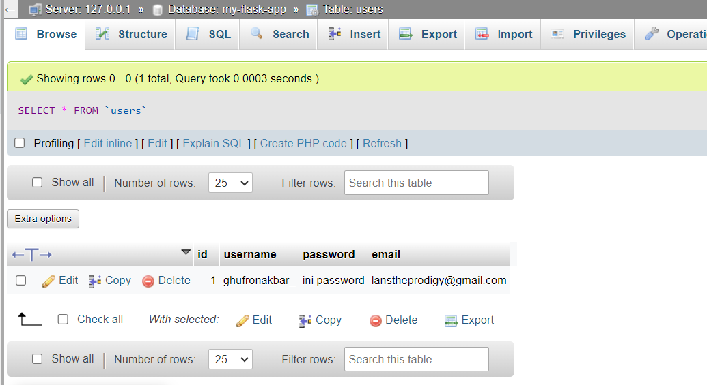

# FLASK + MYSQL

## Requirements

Sebelum memulai, pastikan Anda memiliki semua perangkat yang diperlukan untuk menjalankan aplikasi Flask dengan MySQL:

- **MySQL Server** atau **XAMPP** (untuk menjalankan server MySQL secara lokal)
- **Python** (pastikan Python sudah diinstal di komputer Anda)
- **Flask** (framework Python untuk pengembangan web)

## Install Library

Langkah pertama, install library `flask-mysqldb` yang memungkinkan Flask untuk berinteraksi dengan MySQL:

```
pip install flask-mysqldb
```

## Steps:

### 1. Buka XAMPP dan Nyalakan Apache dan MySQL

Buka XAMPP, lalu nyalakan **Apache** (untuk server web) dan **MySQL** (untuk database). Ini akan memungkinkan Anda menjalankan aplikasi Flask dengan MySQL lokal.


### 2. Buka MySQL Admin dan Buat Database

Setelah MySQL berjalan, buka MySQL Admin (phpMyAdmin), dan buat database baru untuk aplikasi Anda. Misalnya, Anda bisa membuat database dengan nama `flaskapp`.


### 3. Buat Tabel di Database

Selanjutnya, buat tabel di database yang sudah dibuat. Struktur tabel ini akan digunakan untuk menyimpan data yang dikirimkan dari aplikasi Flask. Contoh struktur tabel untuk data pengguna mungkin seperti berikut:

- `id` (INT, Primary Key, Auto Increment)
- `name` (VARCHAR)
- `email` (VARCHAR)
- `password` (VARCHAR)

Pastikan struktur tabel sesuai dengan kebutuhan aplikasi.


### 4. Masukkan Beberapa Data

Setelah tabel dibuat, masukkan beberapa data awal (seed data) ke dalam tabel untuk menguji koneksi aplikasi Flask ke database.


### 5. Periksa Data yang Telah Dimasukkan

Cek data yang sudah Anda masukkan untuk memastikan data berhasil disimpan ke dalam database. Anda dapat melakukannya melalui MySQL Admin atau dengan query SQL sederhana.


### 6. Tulis Kode Flask untuk Terhubung ke Database

Langkah terakhir adalah menulis kode Python menggunakan Flask untuk terhubung ke database MySQL yang sudah dibuat. Pastikan Anda mengkonfigurasi aplikasi Flask dengan benar untuk koneksi MySQL, seperti mengatur `MySQL HOST`, `MySQL USER`, `MySQL PASSWORD`, dan `MySQL DB`.
